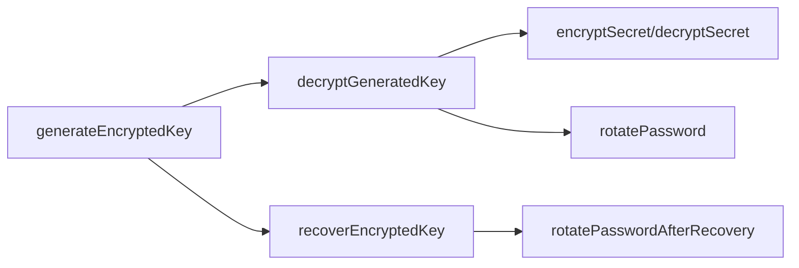

# Function Reference

This section provides detailed documentation for all encryption utility functions.

## Core Functions

### Key Management
- [`generateEncryptedKey`](generateEncryptedKey.md) - Create a new encrypted key with recovery
- [`decryptGeneratedKey`](decryptGeneratedKey.md) - Unlock an encrypted key with password

### Secret Operations
- [`encryptSecret`](encryptSecret.md) - Encrypt sensitive data
- [`decryptSecret`](decryptSecret.md) - Decrypt sensitive data

### Recovery
- [`recoverEncryptedKey`](recoverEncryptedKey.md) - Recover key using mnemonic phrase

### Password Management
- [`rotatePassword`](rotatePassword.md) - Change password while keeping data
- [`rotatePasswordAfterRecovery`](rotatePasswordAfterRecovery.md) - Set new password after recovery

## Function Categories

### 🔑 Key Lifecycle


### 🔐 Data Operations
- **Encryption Flow**: `decryptGeneratedKey` → `encryptSecret`
- **Decryption Flow**: `decryptGeneratedKey` → `decryptSecret`

### 🛡️ Security Operations
- **Password Change**: `rotatePassword`
- **Account Recovery**: `recoverEncryptedKey` → `rotatePasswordAfterRecovery`

## Common Patterns

### Initialize New User
```typescript
// 1. Generate encrypted key
const keyResult = await generateEncryptedKey({ password });

// 2. Store vault data
const vault = {
  encryptedKey: keyResult.encryptedKey,
  salt: keyResult.salt,
  iv: keyResult.iv,
  // Recovery data...
};

// 3. Show recovery phrase to user
console.log('Save this:', keyResult.recoveryPhrase);
```

### User Login
```typescript
// 1. Unlock vault
const unlockResult = await decryptGeneratedKey({
  salt: vault.salt,
  iv: vault.iv,
  encryptedKey: vault.encryptedKey,
  password: userPassword
});

// 2. Use decrypted key for operations
if (unlockResult.success) {
  const { decryptedKey } = unlockResult;
  // Now can encrypt/decrypt secrets
}
```

### Store Secret
```typescript
const result = await encryptSecret({
  secret: 'sensitive-data',
  decryptedKey: userKey
});

// Store result.encryptedSecret and result.iv
```

### Retrieve Secret
```typescript
const result = await decryptSecret({
  encryptedSecret: stored.encryptedSecret,
  iv: stored.iv,
  decryptedKey: userKey
});

// Use result.decryptedSecret
```

## Error Handling

All functions follow the same error handling pattern:

```typescript
type Result<T> = 
  | { success: true } & T
  | { success: false; error: Error };
```

Always check the `success` property before accessing result data:

```typescript
const result = await someFunction(params);

if (result.success) {
  // Access result properties
  console.log(result.data);
} else {
  // Handle error
  console.error(result.error.message);
}
```

## Next Steps

- [📖 Read Individual Function Docs](generateEncryptedKey.md)
- [🔧 See Complete Examples](/examples.md)
- [🛡️ Learn Security Best Practices](/reference/security.md)